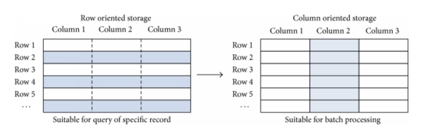

:toclevels: 2
:toc:

= Spark data sources

ifndef::env-github[]
++++

++++
endif::[]

Warm-up::
What are the possible data source for Spark?

== File storage

=== Distributed File System

==== HDFS

.HDFS communication flows
image::https://coderlessons.com/wp-content/uploads/2019/07/hdfs_architecture.jpg[align="center"]

Accessing HDFS::
[source]
----
// Urls provided for demo purpose
val words = spark.read.textFile("hdfs://localhost:9000/user/hduser/words")
----

Keep in mind::
* `NameNode` is single point of failure (only `Secondary NameNode` to mitigate the risk)
* Filling `NameNode` memory with small files meta
* Write once
* Not designed for random access

==== Cloud DFS

* image:https://d1.awsstatic.com/icons/jp/console_s3_icon.64795d08c5e23e92c12fe08c2dd5bd99255af047.png[width=40]
Amazon S3
* image:https://www.cleo.com/sites/default/files/styles/half_page/public/2019-06/azure-header.png?itok=8RyLdNxZ[width=40]
Azure Blob Storage
* image:https://upload.wikimedia.org/wikipedia/commons/thumb/5/59/Google-Cloud-Storage-Logo.svg/1200px-Google-Cloud-Storage-Logo.svg.png[width=40]
Google Cloud Storage
* More...

=== Serialization

==== Row vs Column layout

Practice::
What are your thoughts about PROS/CONS?

Row layout::
* Effective inserts / deletes
* Effective if entire row is read
* Works well for OLTP

Column layout::
* Column pruning and predicate pushdown optimizations
* Goes well with aggregate and vector operations
* Effective compaction
* Fits OLAP cases

==== List of formats

[options="header", cols="3,2,2,2,2"]
|===
| Format | Serialization | Layout | Schema | Support

| image:https://upload.wikimedia.org/wikipedia/en/thumb/9/9c/Apache_Avro_Logo.svg/1280px-Apache_Avro_Logo.svg.png[width=50]
Apache Avro
| Binary
| Row
| Embedded
| Built-in

| image:https://www.bigdataschool.ru/wp-content/uploads/2019/09/%D0%BF%D0%B0%D1%80%D0%BA0.png[width=50]
Apache Parquet
| Binary
| Column
| Embedded
| Built-in

| image:https://pbs.twimg.com/profile_images/614441858651914242/Aor-_I5u.png[width=50]
Apache ORC
| Binary
| Column
| Embedded
| Built-in

| CSV
| Text
| Row
| Semi-structured
| Built-in

| JSON
| Text
| Row
| Semi-structured
| Built-in

| TEXT
| Text
| Row
| No
| Built-in

|===

Practice::
What is the difference between ORC and Parquet formats?

==== Coding

[source]
----
val data = spark.read.format("csv")
  .option("mode", "FAILFAST")
  .option("inferSchema", "true")
  .option("path", "path/to/file(s)")
  .load()

val result = data.transform(myTransformation)

result.write.save("result_filename.parquet")
----

Read mode (csv, json)::
* PERMISSIVE - sets other fields to null when it meets a corrupted record.
* DROPMALFORMED - ignores the whole corrupted records.
* FAILFAST - throws an exception when it meets corrupted records.

Write mode::
* Overwrite - overwrite the existing data.
* Append - append the data.
* Ignore - ignore the operation if target file already exists.
* ErrorIfExists - throw an exception at runtime if target file already exists.

=== Compression

[options="header"]
|===

| Format | Splittable* | Support

| Gzip (`.gz`)
| No
| Built-in

| Bzip (`.bz2`)
| Yes
| Built-in

| LZ4
| No
| Built-in

| LZO (`.lzo`)
| Yes (https://github.com/twitter/hadoop-lzo[adoption])
| https://stackoverflow.com/questions/45376241/importing-a-lzo-file-into-java-spark-as-dataset[Pluggable]

| Snappy
| No
| Built-in

|===

* Ignoring sequence file split as described in the https://www.waitingforcode.com/apache-spark/apache-spark-data-compression/read[post].

=== Optimizations

Partitioning::

Partitioning allow more effective data querying by coarse grained data skipping.

.Example
[source]
----
path
└── to
    └── table
        ├── gender=male
        │   ├── ...
        │   │
        │   ├── country=US
        │   │   └── data.parquet
        │   ├── country=CN
        │   │   └── data.parquet
        │   └── ...
        └── gender=female
            ├── ...
            │
            ├── country=US
            │   └── data.parquet
            ├── country=CN
            │   └── data.parquet
            └── ...

----

.Inferred schema
[source]
----
root
|-- name: string (nullable = true)
|-- age: long (nullable = true)
|-- gender: string (nullable = true)
|-- country: string (nullable = true)
----

CAUTION: Avoid using too many partition columns

CAUTION: Avoid using partition columns with too many distinct values

Bucketing::

* Pre-shuffles and optionally pre-sorts the data while writing
* Avoids shuffling and sorting when joining large datasets

== Databases & Data Warehouses

=== Sql Databases

NOTE: JDBC driver should be in spark classpath.

Read::
[source]
----
val df = spark.read
  .format("jdbc")
  .option("url", "jdbc:postgresql:dbserver")
  .option("dbtable", "schema.tablename")
  .option("user", "username")
  .option("password", "password")
  .load()
----

Write::
[source]
----
df.write
  .format("jdbc")
  .option("url", "jdbc:postgresql:dbserver")
  .option("dbtable", "schema.tablename")
  .option("user", "username")
  .option("password", "password")
  .save()
----

==== Optimizations

===== Parallelism

[source]
----
val df = spark.read
  .format("jdbc")
  ...
  .option("numPartitions", 10)
  .load()
----

===== Query pushdown

[source]
----
spark
  .read.jdbc(jdbcUrl, "diamonds", props)
  .select("carat", "cut", "price")
  .where("cut = 'Good'")
  .explain(true)
----

Practice::
[source]
----
// What will you do if pushdown is not supported out of box?
spark
  .read.jdbc(jdbcUrl, "diamonds", props)
  .select("carat")
  .distinct()
  .explain(true)
----

=== NoSql Databases

* https://docs.mongodb.com/spark-connector/master[MongoDb]
* https://github.com/datastax/spark-cassandra-connector[Cassandra]
* https://github.com/hortonworks-spark/shc[HBase]
* More

=== Hive

image::https://miro.medium.com/max/628/0*d5DOvZIR_O4PPYlb[align="center"]

Spark should be configured to work with Hive
(check the http://spark.apache.org/docs/latest/sql-data-sources-hive-tables.html[docs]).

[source]
----
val spark = SparkSession
  .builder()
  .appName("Spark Hive Example")
  .enableHiveSupport() // Note that!
  .getOrCreate()

val data = spark.table("MY_HIVE_TABLE_NAME")
----

NOTE: Hive dependencies are not included into Spark distribution.