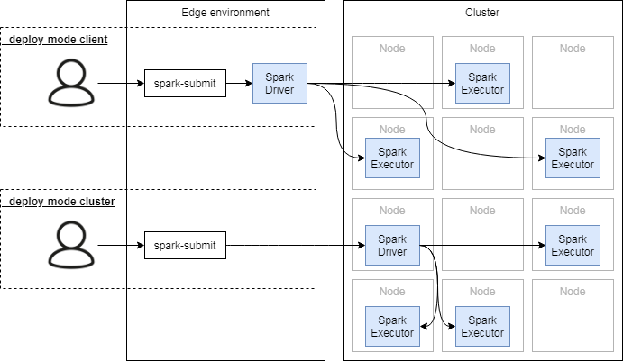

:toclevels: 2
:toc:

= Spark architecture and internals

++++

++++

.Warm-up
Try to link the terms on diagram:
Job, ClusterManager, Worker Node, HDFS, SparkContext, Task, Yarn, Spark, Driver program, Stage,
Dataset, Executor, SparkSession, DataFrame, rdd, Action, Hadoop.

== Spark cluster architecture

image::https://spark.apache.org/docs/latest/img/cluster-overview.png["Cluster Architecture", align="center", link=https://spark.apache.org/docs/latest/cluster-overview.html]

.Practice
What is the difference between `messages.foreach(println)` and `messages.collect().foreach(println)`?
Is there an issue with the later one?

=== Cluster managers

.The list of officially supported cluster managers
[options="header", cols="1,4"]
|===
| Type | Brief

| https://spark.apache.org/docs/latest/spark-standalone.html[Standalone]
| Built into Spark

| http://mesos.apache.org[Apache Mesos]
| Can run Hadoop, Jenkins, Spark, Aurora, and other frameworks on a dynamically shared pool of nodes.

| https://hadoop.apache.org/docs/current/hadoop-yarn/hadoop-yarn-site/YARN.html[Hadoop Yarn]
| Used by: Cloudera, MapR, Hortonworks, AWS EMR, Azure HDInsight, Google Cloud Dataproc

| https://kubernetes.io[Kubernetess]
| Still experimental.
https://towardsdatascience.com/the-pros-and-cons-of-running-apache-spark-on-kubernetes-13b0e1b17093[PROS & CONS article >>]
|===

==== Hadoop Yarn

image::https://hadoop.apache.org/docs/current/hadoop-yarn/hadoop-yarn-site/yarn_architecture.gif[align="center"]

.Hadoop Yarn core components
[options="header", cols="1,4"]
|===
| Component | Role

| Resource Manager
| Per cluster agent that arbitrate cluster resources among applications

| Node Manager
| Per-node agent that controls containers on the node, monitor and report resource usage (eg. CPU and RAM).

| Application Manager
| Per-application framework specific library that negotiate resources from the ResourceManager
and works with the NodeManagers to execute and monitor the tasks.

| Container
| A set of compute resources (eg CPU, RAM) that could be taken by an application for processing

|===

.Spark integration into Yarn

.Client vs Cluster mode

== RDD

.Resilient Distributed dataset

.Building RDDs

* Parallelize local collection `val rdd = sc.parallelize(Array(1, 2, 3))`
* External sources `val rdd = sc.textFile(hdfs_path)`
* Transformation `val rdd2 = rdd1.map(_.split(“ ”))`

=== Dependencies

.Code example
[source]
----
rdd1 = msgs.filter(_.date.after(d20200101))
rdd2 = rdd1.map(m => (m.user, 1))
rdd3 = rdd2.reduceByKey(_ + _)

rdd4 = user.filter(_.birth.after(d20000101))
rdd5 = rdd4.map(u => (u.id, u.name))

rdd6 = rdd5.join(rdd3)

rdd6.take(10).foreach(println)
----

.Lineage graph

.https://mallikarjuna_g.gitbooks.io/spark/spark-rdd-lineage.html[.toDebugString()]
[source]
----
(2) MapPartitionsRDD[9] at join at RddExperiment.scala:43
 |  MapPartitionsRDD[8] at join at RddExperiment.scala:43 []
 |  CoGroupedRDD[7] at join at RddExperiment.scala:43 []
 +-(2) MapPartitionsRDD[6] at map at RddExperiment.scala:41 []
 |  |  MapPartitionsRDD[5] at filter at RddExperiment.scala:40 []
 |  |  ParallelCollectionRDD[1] at parallelize at RddExperiment.scala:19 []
 |  ShuffledRDD[4] at reduceByKey at RddExperiment.scala:38 []
 +-(2) MapPartitionsRDD[3] at map at RddExperiment.scala:37 []
    |  MapPartitionsRDD[2] at filter at RddExperiment.scala:36 []
    |  ParallelCollectionRDD[0] at parallelize at RddExperiment.scala:13 []
----

.http://127.0.0.1:4041/jobs/job/?id=...
image::./materials/rdd-lineage-example.png[align="center"]

.Practice - is the code ok?
[source]
----
val rdd = loadData()
logger.info(“Transformation started”)
val result = rdd.map(transform)
logger.info(“Transformation finished”)
storeResult(result)
----

==== Narrow vs Wide dependencies

.Narrow vs Wide dependecies

.Practice - How will partition dependencies look like?
image::./materials/rdd-narrow-vs-wide-dependecy-examples.png[align="center"]

== Spark execution model

.Action vs Job vs Stage vs Task

.Stages

NOTE: How do stages correlate with partitions?

.Task

.Practice - what are the stage boundaries?

=== Scheduling process rehearsal

.Scheduling process

.Process example
[source]
----
// Load the text into a Spark RDD from the names folder
val result = spark.sparkContext.textFile("src/main/resources/data/names")
  .map(name => (name.charAt(0), name))
  .groupByKey()
  .mapValues(names => names.toSet.size)
  .collect()
----

.Scheduling process - RDD

.Scheduling process - Stages

.Scheduling process - Tasks

== Practice point

.Practice - Scheduling process #1
[source]
----
val result = messages
  .map(m => (getYear(m.date), m.text.length))
  .reduceByKey {
    case (l1: Int, l2: Int) => if (l1 > l2) l1 else l2
   }
  .collect()
----

.Practice - Scheduling process #2
[source]
----
val result = rdd
  .map(m => (m.date, m.text.length))
  .sortBy(v => v._2, ascending=false)
  .take(10)
----

.Practice - Scheduling process #3
[source]
----
users
  .filter(_.birth.after(d20000101))
  .map(v => (v.id, v.name))
  .repartition(5)
  .foreach(saveToDatabase)
----

.Practice - Scheduling process #4
[source]
----
val result = users
  .filter(_.name.startsWith("A"))
  .map(v => (v.name, 1))
  .reduceByKey(_ + _)
  .filter(_._2 < 5)
  .collectAsMap()
----

== Fault tolerance

.Example of a problem

.Recovery process in action
