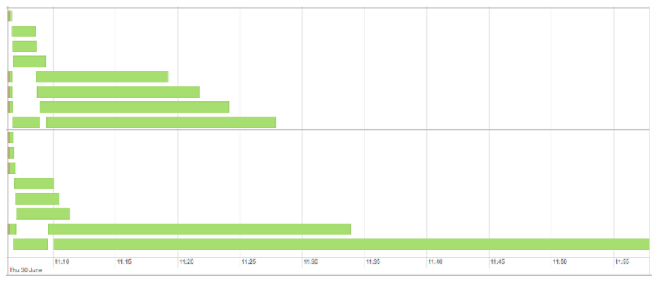
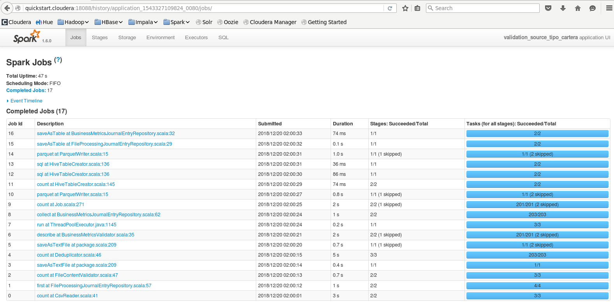

:toclevels: 2
:toc:

= Spark performance

ifndef::env-github[]
++++

++++
endif::[]

== Parallelism

*Practice:*
Is the code below ok?

[source]
----
messages
  .map(v => v.copy(text = anonymize(v.text)))
  .filter(_.text.contains("Trump"))
  .foreach(saveToDatabase(_))
----

*Practice:*
How many threads in the code above will write to database?

=== Factors

* Num of executors
* Num of core
* Num of partitions
** Evaluate .coalesce() instead of .repartition() to reduce num of partitions
** Configs `spark.default.parallelism` & `spark.sql.shuffle.partitions`
(https://stackoverflow.com/questions/45704156/what-is-the-difference-between-spark-sql-shuffle-partitions-and-spark-default-pa/45704560#45704560[usage >>])

*Practice:*
Are there any problems with having either too few or too many partitions?

=== Data source

*Practice:*
Is the code below ok?

[source]
----
spark.read
  .textFile("message_archive.gz")
  .filter(_.contains("Donald"))
  .map(_.slice(0, 100))
  .foreach(saveToDatabase(_))
----

See link:../lecture-spark-datasources/lecture-spark-datasources.adoc[Spark datasources] lecture for details.

=== Balance

*Practice:* What is the problem that is shown on the image below?

.Data skew

Check https://www.davidmcginnis.net/post/spark-job-optimization-dealing-with-data-skew[dealing with data skew] post.

== Hardware

* Know your cluster
** #Nodes, CPU, RAM, Disk
** Node failures and freezes?
* Who is using the cluster?

=== RAM

* `--executor-memory`
* `spark.executor.memory` & `spark.yarn.executor.memoryOverhead`
* Avoid spills to Disk

=== Resource planning

Check https://www.coursera.org/lecture/big-data-analysis/resource-allocation-eCA3W[resource allocation guide]
(https://spoddutur.github.io/spark-notes/distribution_of_executors_cores_and_memory_for_spark_application.html[text form]):

* `--num-executors` & `--executor-cores`
(also see https://www.coursera.org/lecture/big-data-analysis/dynamic-allocation-xRflN[dynamic allocation])
* `--executor-memory`

== Toolbox

=== Catalyst

*Recap:* What is Catalyst optimizer?
What are Parsed, Logical, Optimized and Physical plans (`df.explain(true)`)?

=== Joins

* Shuffle Hash & Sort Merge
* Cartesian (How to avoid?)
* Broadcast Hash

=== Datasources

* Hive partitions ( != Spark partitions)
* Columnar formats (Parquet, ORC, etc). How could it help?
* Serialization & Compression
** Kryo over Java Serialization for RDD.
** Encoders. Avoid .javaSerialization() & .kryo()
** Compression (eg. gzip, lzo, snappy, etc).
*** Source vs Shuffle
*** Memory vs CPU
*** https://www.youtube.com/watch?v=MKJq2CrzCno[Best practices]

=== Caching

* `.cache()` & `.persist()` (Storage: `MEMORY_ONLY, DISK_ONLY, MEMORY_AND_DISK`)
* `.checkpoint()` is more reliable, but slower
More >>
* https://www.coursera.org/lecture/big-data-analysis/persistance-and-checkpointing-qE6wK[Details >>]

*Practice:* When should you cache data?

=== Spark Web UI

.https://spark.apache.org/docs/3.0.0-preview/web-ui.html[Web UI >>]

=== More to discover

* OFF-Heap persistence
* Vectorized UDFs
* Spark & GPU
* ...

== Coding

*Practice:* Is the code below ok?

.Example #1
[source]
----
val young = users
  .filter(_.birth.after(d20200101))
  .count()

if (young > 0) {
  logger.warn("Too young customers were detected")
}
----

.Example #2
[source]
----
msgs
  .join(usrs, msgs.col("user") === usrs.col("id"))
  .groupBy(col("user"))
  .count()
  .filter(col("user") contains "Donald")
----

.Example #3
[source]
----
val byUser = msgs
  .filter(col("user") contains "Donald")
  .groupBy("date")
  .count()

val aboutUser = msgs
  .filter(col("text") contains "Donald")
  .groupBy("date")
  .count()

byUser
  .join(aboutUser, "date")
  .withColumn("sent", byUser("count"))
  .withColumn("mentions", aboutUser("count"))
----

*Practice:*

* Check execution plan for you project (`.explain()`). Share with Mentor
* Check execution with Spark Web UI. Share screenshots with Mentor

